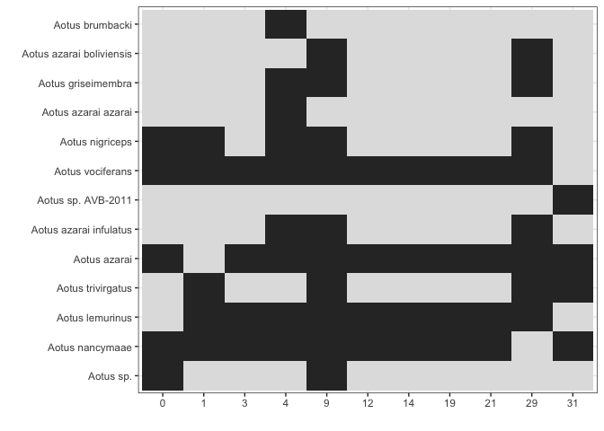
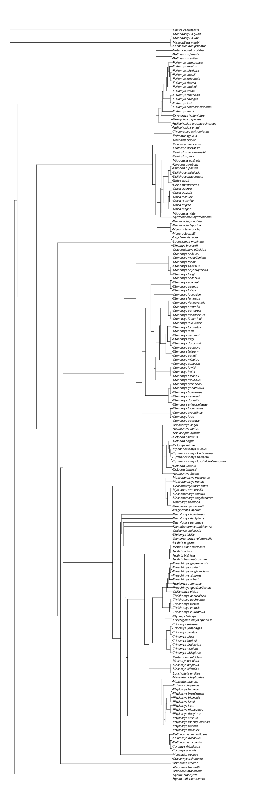

<!-- README.md is generated from README.Rmd. Please edit that file -->
<!-- devtools::rmarkdown::render("README.Rmd") -->
<!-- Rscript -e "library(knitr); knit('README.Rmd')" -->
Mini `supersmartR` Workshop 
==============================================================================================================================================

> Originally put together for a mini-workshop on 8 Nov. 2019 in Gothenburg, Sweden.

-   [`supersmartR`](https://github.com/AntonelliLab/supersmartR) is a series of R packages that form a phylogenetic pipeline.
-   The original [SUPERSMART](https://github.com/naturalis/supersmart) program uses a "divide-and-conquer" apprach to constructing large phylogenetic trees.
-   It combines both a supermatrix (an assembly of multiple gene/clusters into a single matrix) and a supertree (merging multiple trees) approach.
-   `supersmartR` packages are standalone packages with their own functions and uses BUT they can be combined to recreate the supersmart pipeline.

### [SUPERSMART](http://www.supersmart-project.org/)


### [supersmartR](https://github.com/AntonelliLab/supersmartR)


The Workshop
------------

This workshop we will [introduce the packages](#packages) and provide code to run a simple [pipeline](#pipeline) to create a phylogenetic tree (a supertree of all Guinea-pig-like species).

*Duration ~1 hr*

------------------------------------------------------------------------

Prerequisites
=============

-   Software
    -   [R](https://cran.r-project.org/) (&gt; 3.5)
    -   [RStudio](https://www.rstudio.com/)
    -   [Desktop Docker](https://docs.docker.com/install/) (Linux containers)
-   Basic knowledge
    -   R
    -   Phylogenetics

(Windows users may struggle installing Docker Desktop, in which case Docker Toolbox will also work.)

### R packages

Install dependant packages.

``` r
# remotes allows installation via GitHub
if (!'remotes' %in% installed.packages()) {
  install.packages('remotes')
}

library(remotes)
# install latest outsider
install_github("antonellilab/outsider.base")
install_github("antonellilab/outsider")
# install latest restez
install_github("hannesmuehleisen/MonetDBLite-R")
install_github("ropensci/restez")
# install latest phylotaR
install_github("ropensci/phylotaR")
# install latest gaius
install_github("antonellilab/gaius")
```

If you're computer is set-up correctly with the R packages and Docker, you should be able to run the below script without errors (don't worry about security warnings).

``` r
## Code
library(outsider)
#> ----------------
#> outsider v 0.1.0
#> ----------------
#> - Security notice: be sure of which modules you install
repo <- "dombennett/om..hello.world"
module_install(repo = repo, force = TRUE)
hello_world <- module_import(fname = "hello_world", repo = repo)
hello_world()

## Output
#> Hello world!
#> ------------
#> DISTRIB_ID=Ubuntu
#> DISTRIB_RELEASE=18.04
#> DISTRIB_CODENAME=bionic
#> DISTRIB_DESCRIPTION="Ubuntu 18.04.1 LTS"
```

------------------------------------------------------------------------

Setup
=====

To run all the code in this workshop you will need to:

-   Download the zipped folder of this GitHub repo, [click here](https://github.com/AntonelliLab/supersmartR-workshop-mini/archive/master.zip).
-   Unzip this folder and place it in a convenient location on your computer (e.g. "my coding projects").
-   Open RStudio and create a new project from this new folder.


------------------------------------------------------------------------

Tutorials
=========

Packages
--------

### [`phylotaR`](https://github.com/ropensci/phylotaR)

The `phylotaR` package downloads all sequences associated with a given taxonomic group and then runs all-vs-all BLAST to identify clusters of sequences suitable for phylogenetic analysis.

The process takes place across four stages:

-   Taxise: identify taxonomic IDs
-   Download: download sequences
-   Cluster: run all-vs-all BLAST
-   Cluser^2: run all-vs-all BLAST again


#### Setup

To run `phylotaR`, we need to set up a folder to host all downloaded files. Parameters for setting up the folder are provided to the `setup` function.

``` r
# NOT RUN
library(phylotaR)
# available parameters
print(parameters())
# e.g. mnsql = 200 - minimum sequence length
# pass the parameters to the setup() function
# essential parmeters are: wd, txid
wd <- file.path(tempdir(), 'testing_phylotaR')
if (dir.exists(wd)) {
  unlink(x = wd, recursive = TRUE, force = TRUE)
}
dir.create(wd)
setup(wd = wd, txid = '9504', outsider = TRUE, v = TRUE)
# to run the pipeline
# run(wd = wd)
```

#### Parsing results

Read in the phylotaR results with `read_phylota`. But here we will use the pacakge example data, "Aotus".

##### Summarise the clusters

``` r
library(phylotaR)
data(aotus)
# generate summary stats for each cluster
smmry_tbl <- summary(aotus)
# Important details
#  N_taxa     - number of taxonomic entities associated with sequences in cluster
#  N_seqs     - number of sequences in cluster
#  Med_sql    - median sequence length of sequences in cluster
#  MAD        - measure of the deviation in sequence length of a cluster
#  Definition - must common words in sequence definition lines
smmry_tbl[1:10, ]
#>    ID    Type               Seed Parent N_taxa N_seqs Med_sql       MAD
#> 1   0 subtree         AF129794.1   9504      5    204     267 0.7124669
#> 2   1 subtree           U52114.1   9504      5     63    1020 0.7604098
#> 3   2 subtree         DI178118.1   9504      2     52     267 0.8666904
#> 4   3 subtree         JQ932794.1   9504      4     43     568 0.6643121
#> 5   4 subtree           U36844.1   9504      9     41     549 0.8397112
#> 6   5 subtree KF014117.1/1..1263   9504      1     35    1281 0.7731248
#> 7   6 subtree         LC075891.1   9504      2     33     838 0.8026216
#> 8   7 subtree         JN161069.1   9504      1     30    1088 0.9985614
#> 9   8 subtree         JN161069.1  30591      1     30    1088 0.9985614
#> 10  9 subtree         AJ489745.1   9504     10     29    1140 1.0000000
#>                           Definition                      Feature
#> 1       aotus (0.07), partial (0.07) aovodrb (0.5), aonadrb (0.5)
#> 2         aotus (0.09), class (0.09)                     mhcf (1)
#> 3  antibody (0.05), construct (0.05)           jp (0.3), kr (0.2)
#> 4         aotus (0.2), genomic (0.2)                            -
#> 5    gene (0.1), mitochondrial (0.1)                     coii (1)
#> 6        allele (0.08), aotus (0.08) kir3ds3 (0.2), kir2ds5 (0.1)
#> 7             dna (0.1), aotus (0.1)                            -
#> 8          azarai (0.2), aotus (0.1)                            -
#> 9          azarai (0.2), aotus (0.1)                            -
#> 10     aotus (0.1), cytochrome (0.1) cytb (0.4), cytochrome (0.3)
```

``` r
# plot
p <- plot_phylota_treemap(phylota = aotus, cids = aotus@cids[1:10],
                          area = 'nsq', fill = 'ntx')
print(p)
```


##### Understand the PhyLoTa table (`aotus`)

``` r
# CODE

# PhyLoTa table has ...
# clusters
aotus@clstrs
# sequences
aotus@sqs
# taxonomy
aotus@txdct
# A cluster is a list of sequences
aotus@clstrs@clstrs[[1]]
str(aotus@clstrs@clstrs[[1]])
# A sequence is a series of letters and associated metadata
aotus@sqs@sqs[[1]]
str(aotus@sqs@sqs[[1]])
# A taxonomic record is an ID and associated metadata
txid <- aotus@txids[[1]]
# Information can be extracted from ...
# clusters
get_clstr_slot(phylota = aotus, cid = aotus@cids[1:10], slt_nm = 'nsqs')
# sequences
get_sq_slot(phylota = aotus, sid = aotus@sids[1:10], slt_nm = 'nncltds')
# tax. records
get_tx_slot(phylota = aotus, txid = aotus@txids[1:10], slt_nm = 'scnm')
# Other useful convenience functions
get_nsqs(phylota = aotus, cid = aotus@cids[1:10])
get_ntaxa(phylota = aotus, cid = aotus@cids[1:10], rnk = 'species')

# OUTPUT
#> Archive of cluster record(s)
#>  - [193] clusters
#> Archive of sequence record(s)
#>  - [1499] sequences
#>  - [13] unique txids
#>  - [548] median sequence length
#>  - [0] median ambiguous nucleotides
#> Taxonomic dictionary [21] recs, parent [id 9504]
#> Cluster Record [id 0]
#>  - [subtree] type
#>  - [AF129794.1] seed sequence
#>  - [204] sequences
#>  - [5] taxa
#> Formal class 'ClstrRec' [package "phylotaR"] with 8 slots
#>   ..@ id   : int 0
#>   ..@ sids : chr [1:204] "AF129792.1" "AF129793.1" "AF129794.1" "AF129795.1" ...
#>   ..@ nsqs : int 204
#>   ..@ txids: chr [1:204] "231953" "231953" "231953" "231953" ...
#>   ..@ ntx  : int 5
#>   ..@ typ  : chr "subtree"
#>   ..@ prnt : chr "9504"
#>   ..@ seed : chr "AF129794.1"
#> SeqRec [ID: FJ623078.1]Formal class 'SeqRec' [package "phylotaR"] with 16 slots
#>   ..@ id     : chr "FJ623078.1"
#>   ..@ nm     : chr ""
#>   ..@ accssn : chr "FJ623078"
#>   ..@ vrsn   : chr "FJ623078.1"
#>   ..@ url    : chr "https://www.ncbi.nlm.nih.gov/nuccore/FJ623078.1"
#>   ..@ txid   : chr "37293"
#>   ..@ orgnsm : chr "Aotus nancymaae"
#>   ..@ sq     : raw [1:1374] 61 74 67 67 ...
#>   ..@ dfln   : chr "Aotus nancymaae CD4 antigen (CD4) mRNA, complete cds"
#>   ..@ ml_typ : chr "mRNA"
#>   ..@ rec_typ: chr "whole"
#>   ..@ nncltds: int 1374
#>   ..@ nambgs : int 0
#>   ..@ pambgs : num 0
#>   ..@ gcr    : num 0.447
#>   ..@ age    : int 3412
#>   0   1   2   3   4   5   6   7   8   9 
#> 204  63  52  43  41  35  33  30  30  29 
#>         FJ623078.1           U38998.1           U88361.1 
#>               1374                525                465 
#>         AY684995.1         AY684994.1         AY684993.1 
#>                954               1425               1389 
#> AY684992.1/1..1422  AY684991.1/1..975           U88362.1 
#>               1422                975                465 
#>           U88363.1 
#>                465 
#>                      37293                       9505 
#>          "Aotus nancymaae"        "Aotus trivirgatus" 
#>                      57176                      57175 
#>         "Aotus vociferans"          "Aotus nigriceps" 
#>                      43147                     231953 
#>          "Aotus lemurinus"                "Aotus sp." 
#>                      30591                     280755 
#>             "Aotus azarai" "Aotus azarai boliviensis" 
#>                     867331                     292213 
#>   "Aotus azarai infulatus"       "Aotus griseimembra" 
#>   0   1   2   3   4   5   6   7   8   9 
#> 204  63  52  43  41  35  33  30  30  29 
#> 0 1 2 3 4 5 6 7 8 9 
#> 5 5 2 4 7 1 2 1 1 8
```

##### Select clusters

``` r
# CODE

# use the summary table to extract cids of interest
nrow(smmry_tbl)
# keep clusters with MAD above 0.5
smmry_tbl <- smmry_tbl[smmry_tbl[['MAD']] >= 0.5, ]
nrow(smmry_tbl)
# keep clusters with more than 10 seqs
smmry_tbl <- smmry_tbl[smmry_tbl[['N_seqs']] >= 10, ]
nrow(smmry_tbl)
# keep clusters with more than 4 species
nspp <- get_ntaxa(phylota = aotus, cid = smmry_tbl[['ID']], rnk = 'species')
selected_cids <- smmry_tbl[['ID']][nspp >= 4]
length(selected_cids)
# create selected PhyLoTa table
selected_clusters <- drop_clstrs(phylota = aotus, cid = selected_cids)

# OUTPUT
#> [1] 193
#> [1] 193
#> [1] 33
#> [1] 11
```

##### Plotting selected clusters

``` r
# CODE

# extract scientific names for taxonomic IDs
scnms <- get_tx_slot(phylota = selected_clusters, txid = selected_clusters@txids,
                     slt_nm = 'scnm')
# plot presence/absence
plot_phylota_pa(phylota = selected_clusters, cids = selected_clusters@cids,
                txids = selected_clusters@txids, txnms = scnms)
```



##### Writing to file

``` r
# CODE

# reduce clusters to repr. of 1 seq. per sp.
reduced_clusters <- drop_by_rank(phylota = selected_clusters, rnk = 'species',
                                 n = 1)
reduced_clusters
# write out first cluster
sids <- reduced_clusters@clstrs[['0']]@sids
txids <- get_txids(phylota = reduced_clusters, sid = sids, rnk = 'species')
scnms <- get_tx_slot(phylota = reduced_clusters, txid = txids, slt_nm = 'scnm')
outfile <- file.path(tempdir(), 'cluster_1.fasta')
write_sqs(phylota = reduced_clusters, sid = sids, sq_nm = scnms,
          outfile = outfile)
cat(readLines(outfile), sep = '\n')

# OUTPUT
#> Phylota Table (Aotus)
#> - [11] clusters
#> - [63] sequences
#> - [11] source taxa
#> >Aotus nancymaae
#> cgtttcttgttccagactacgtctgagtgtcatttcttcaacgggacggagcgggtgcggttcctggacagatacttcta
#> taaccaggaggagtatgtgcgcttcgacagcgacgtgggggagtaccgggcggtgacggagctggggcggcggagcgcag
#> agtactggaacagccagaaggacttcctggaggagaggcgggccttggtggacacctactgtagatacaactacggggtt
#> gctgagagcttcacagtgcagcggcgaa
#> 
#> >Aotus nigriceps
#> cgtttcttgttccagactacgtctgagtgttatttcttcaacgggacggagcgggtgcggtacctggacagatactttta
#> taaccaggaggaatatgtgcgcttcgacagcgacgtgggggagtaccgggcggtgacggagctggggcggcctgacgccg
#> agtactggaacagccagaaggactacgtggagcggaagcggggccaggtggacaactactgcagacacaactacggggtt
#> ggtgagagcttcacagtgcagcggcgaa
#> 
#> >Aotus sp.
#> ctcgtttcttggagcaggctaagtatgagtgtcatttcctcaacgggacggagcgggtgcggttcctggaaagacacatc
#> cataaccaggaggagtatgcgcgcttcgacagcgacgtgggggagtaccgggcggtgacggagctggggcggcggaccgc
#> agagtactggaacagccagaaggacatcctggaggacaggcgggcccaggtggacaccgtgtgcagacacaactacgggg
#> ttggtgagagcttcacagtgcagcggaga
#> 
#> >Aotus azarai
#> ttggagctggttaagcatgagtgtcatttcttcaacgggacggagcgggtgcggtacctggacagatacctttataacca
#> gaaggagtatgtgcgcttcgacagcgacgtgggggagtaccgggcggtgacggagctggggcggcctgacgccgagtact
#> ggaacagccagaaggactacgtggagcagaagcggggccaagtggacaactactgcagacacaactacggggtttttgag
#> agcttcacagtg
#> 
#> >Aotus vociferans
#> cgtttcttggagcagtttaagcctgaatgtcatttcttcaacgggacggagcgggtgcggttcctggacagatacttcta
#> taaccaggaggagtatgtgcgcttcgacagcgacgtgggggagtaccgggcggtgacggagctggggcggcctgacgccg
#> agtactttaacagcctgaaggacttcatggaggagacgcgggccgcggtggacacctactgcagacacaactacggggtt
#> gttgagagcttcaca
```

### [`restez`](https://github.com/ropensci/restez)

`restez` is a package that allows users to download whole chunks of NCBI's [GenBank](https://www.ncbi.nlm.nih.gov/genbank/). The package works by:

-   Downloading compressed files of sections of GenBank
-   Unpacking these files and building a local GenBank copy
-   Providing generic functions for interacting with the local copy


#### Set-up your first `restez` database

Here, we will do the following:

1.  Specify a location for our database (`restez_path`)
2.  Download the smallest section of GenBank (unannotated)
3.  Build a local database

``` r
# CODE

library(restez)
#> -------------
#> restez v1.0.2
#> -------------
#> Remember to restez_path_set() and, then, restez_connect()
# 1. Set the filepath for where the database will be stored
rstz_pth <- file.path(tempdir(), 'unannotated_database')
if (!dir.exists(rstz_pth)) {
  dir.create(rstz_pth)
}
restez_path_set(filepath = rstz_pth)
# 2. Download
# select number 20, for unannoated (the smallest section)
db_download(preselection = '20')
# 3. Create database
# connect to empty database
restez_connect()
#> Remember to run `restez_disconnect()`
db_create()
# always disconnect from a database when not in use.
restez_disconnect()

# OUTPUT
#> ... Creating '/var/folders/ps/g89999v12490dmp0jnsfmykm0043m3/T//Rtmp61lzsZ/unannotated_database/restez'
#> ... Creating '/var/folders/ps/g89999v12490dmp0jnsfmykm0043m3/T//Rtmp61lzsZ/unannotated_database/restez/downloads'
#> ────────────────────────────────────────────────────────────────────────────────────
#> Looking up latest GenBank release ...
#> ... release number 234
#> ... found 2539 sequence files
#> ────────────────────────────────────────────────────────────────────────────────────
#> Which sequence file types would you like to download?
#> Choose from those listed below:
#> ● 1  - 'EST (expressed sequence tag)'
#>         574 files and 243 GB
#> ● 2  - 'Bacterial'
#>         387 files and 168 GB
#> ● 3  - 'GSS (genome survey sequence)'
#>         268 files and 117 GB
#> ● 4  - 'Constructed'
#>         211 files and 88.6 GB
#> ● 5  - 'Patent'
#>         201 files and 84.1 GB
#> ● 6  - 'Plant sequence entries (including fungi and algae)'
#>         186 files and 93.1 GB
#> ● 7  - 'Other vertebrate'
#>         165 files and 68.2 GB
#> ● 8  - 'TSA (transcriptome shotgun assembly)'
#>         127 files and 53.9 GB
#> ● 9  - 'Invertebrate'
#>         110 files and 47.2 GB
#> ● 10 - 'HTGS (high throughput genomic sequencing)'
#>         82 files and 36.7 GB
#> ● 11 - 'Environmental sampling'
#>         58 files and 24.9 GB
#> ● 12 - 'Primate'
#>         34 files and 14.1 GB
#> ● 13 - 'Viral'
#>         34 files and 14.9 GB
#> ● 14 - 'Other mammalian'
#>         33 files and 9.57 GB
#> ● 15 - 'Synthetic and chimeric'
#>         27 files and 10.7 GB
#> ● 16 - 'Rodent'
#>         18 files and 7.41 GB
#> ● 17 - 'STS (sequence tagged site)'
#>         11 files and 4.45 GB
#> ● 18 - 'HTC (high throughput cDNA sequencing)'
#>         8 files and 3.45 GB
#> ● 19 - 'Phage'
#>         4 files and 1.52 GB
#> ● 20 - 'Unannotated'
#>         1 files and 0.00175 GB
#> Provide one or more numbers separated by spaces.
#> e.g. to download all Mammalian sequences, type: "12 14 16" followed by Enter
#> 
#> Which files would you like to download?
#> ────────────────────────────────────────────────────────────────────────────────────
#> You've selected a total of 1 file(s) and 0.00175 GB of uncompressed data.
#> These represent: 
#> ● 'Unannotated'
#> 
#> Based on stated GenBank files sizes, we estimate ... 
#> ... 0.00035 GB for  compressed, downloaded files
#> ... 0.00214 GB for the SQL database
#> Leading to a total of 0.00249 GB
#> 
#> Please note, the real sizes of the database and its downloads cannot be
#> accurately predicted beforehand.
#> These are just estimates, actual sizes may differ by up to a factor of two.
#> 
#> Is this OK?
#> ────────────────────────────────────────────────────────────────────────────────────
#> Downloading ...
#> ... 'gbuna1.seq' (1/1)
#> Done. Enjoy your day.
#> Adding 1 file(s) to the database ...
#> ... 'gbuna1.seq.gz' (1/1)
#> Done.
```

Query the database
------------------

We can send queries to the database using two different methods: `restez` functions or [`rentrez`](https://ropensci.org/tutorials/rentrez_tutorial/) wrappers.

> **What is `rentrez`?** The `rentrez` package allows users to interact with NCBI Entrez. `restez` wraps around some of its functions so that instead of sending queries across the internet, the local database is checked first.

``` r
# CODE

# import library, point to database and connect
library(restez)
rstz_pth <- file.path(tempdir(), 'unannotated_database')
restez_path_set(filepath = rstz_pth)
restez_connect()
#> Remember to run `restez_disconnect()`
# Check the status
restez_status()
# Get a random ID from the database
id <- sample(x = list_db_ids(n = 100), size = 1)
#> Warning in list_db_ids(n = 100): Number of ids returned was limited to [100].
#> Set `n=NULL` to return all ids.
# print record information
record <- gb_record_get(id)
cat(record)
# see ?gb_record_get for more query functions
# always disconnect
restez_disconnect()

# OUTPUT
#> Checking setup status at  ...
#> ────────────────────────────────────────────────────────────────────────────────────
#> Restez path ...
#> ... Path '/var/folders/ps/g89999v12490dmp0jnsfmykm0043m3/T//Rtmp61lzsZ/unannotated_database/restez'
#> ... Does path exist? 'Yes'
#> ────────────────────────────────────────────────────────────────────────────────────
#> Download ...
#> ... Path '/var/folders/ps/g89999v12490dmp0jnsfmykm0043m3/T//Rtmp61lzsZ/unannotated_database/restez/downloads'
#> ... Does path exist? 'Yes'
#> ... N. files 2
#> ... N. GBs 0
#> ... GenBank division selections 'Unannotated'
#> ... GenBank Release 234
#> ... Last updated '2019-11-07 13:49:00'
#> ────────────────────────────────────────────────────────────────────────────────────
#> Database ...
#> ... Path '/var/folders/ps/g89999v12490dmp0jnsfmykm0043m3/T//Rtmp61lzsZ/unannotated_database/restez/sql_db'
#> ... Does path exist? 'Yes'
#> ... N. GBs 0
#> ... Is database connected? 'Yes'
#> ... Does the database have data? 'Yes'
#> ... Number of sequences 543
#> ... Min. sequence length 0
#> ... Max. sequence length Inf
#> ... Last_updated '2019-11-07 13:49:04'
#> LOCUS       AF298103                 647 bp    DNA     linear   UNA 23-NOV-2000
#> DEFINITION  Unidentified clone B27 DNA sequence from ocean beach sand.
#> ACCESSION   AF298103
#> VERSION     AF298103.1
#> KEYWORDS    .
#> SOURCE      unidentified
#>   ORGANISM  unidentified
#>             unclassified sequences.
#> REFERENCE   1  (bases 1 to 647)
#>   AUTHORS   Naviaux,R.K.
#>   TITLE     Sand DNA: a multigenomic library on the beach
#>   JOURNAL   Unpublished
#> REFERENCE   2  (bases 1 to 647)
#>   AUTHORS   Naviaux,R.K.
#>   TITLE     Direct Submission
#>   JOURNAL   Submitted (21-AUG-2000) Medicine, University of California, San
#>             Diego School of Medicine, 200 West Arbor Drive, San Diego, CA
#>             92103-8467, USA
#> FEATURES             Location/Qualifiers
#>      source          1..647
#>                      /organism="unidentified"
#>                      /mol_type="genomic DNA"
#>                      /db_xref="taxon:32644"
#>                      /clone="B27"
#>                      /note="anonymous environmental sample sequence from ocean
#>                      beach sand"
#> ORIGIN      
#>         1 gatcccgacc ttgatgctgt tcaagggcgg caacgtcgag gcgaccaagg tcggggcact
#>        61 gtcgaagagc cagctcgcgg catttctcga cagcaatctc tgagcgcgac gcgcgccgcc
#>       121 gtcatgtggc gctcatcacg aaaacttcgt cacacggggt agacgccccc tgaggcgcgt
#>       181 gttaggtttt tcatacaccg gcgcactcgc gccgtcctca ccttcatccg tacccagcac
#>       241 acgcttgctc acgcccatac ccgtgcggtc gtcatgaccg tcgaccgtgc tgcccgccag
#>       301 tccgcctctt ggattgctta atgaacctca cagagttgaa acagaaaacc gccccggagc
#>       361 tgctcgagct gtcgcaggag ctcggcatcg agggcatggc ccgctcgcgc aagcaggacg
#>       421 tgatcttcgc gatcctgaag aaccaggcga agaagggcga ggacatctac ggcgacggcg
#>       481 tgctcgaaat ccttcaggac ggattcggct tnctgcgctc gtctgacagc ttctacctgg
#>       541 ccgggcccga cgacatttac gtnagtccna gccanatccg ccgcttnggc tgncaccggn
#>       601 nnaccgtggt tggaaagata aggcttcaaa ggagggaagc gctcttt
#> //
```

### [`outsider`](https://github.com/antonellilab/outsider)

### [`gaius`](https://github.com/antonellilab/gaius)

Pipeline
--------

A complete pipeline for constructing a phylogenetic tree of all Caviomorpha species is contained in `pipeline/`. The pipeline uses the above packages and their functions. We can run each script of the pipeline using `source()`. (To save time we will skip the `restez` and `phylotaR` steps and download a completed folder of the first part of the results.)

``` r
## Code

# minor outsider set-up
if (file.exists('gc_setup.R')) {
  source(file = 'gc_setup.R', local = FALSE, echo = FALSE, print.eval = FALSE)
}

# save time by skipping the first two stages by using the ready
#  1_phylotaR/ in data/
zipfile <- file.path('data', '1_phylotaR.zip')
if (file.exists(zipfile)) {
  utils::unzip(zipfile = zipfile, exdir = 'pipeline', overwrite = TRUE)
}

# run each script in the pipeline
# stage_scripts <- c('2_clusters.R', '3_align.R', '4_supermatrix.R',
#                    '5_phylogeny.R', '6_supertree.R', '7_view.R')
stage_scripts <- c('2_clusters.R',  '4_supermatrix.R',
                    '6_supertree.R', '7_view.R')
start_time <- Sys.time()
cat('Running pipeline ....\n', sep = '')
for (stage_script in stage_scripts) {
  cat('... ', crayon::green(stage_script), '\n', sep = '')
  scriptenv <- new.env()
  source(file.path('pipeline', stage_script), local = scriptenv,
         echo = FALSE, print.eval = FALSE)
}
end_time <- Sys.time()
duration <- difftime(end_time, start_time, units = 'mins')
cat('Duration: ', crayon::red(round(x = duration, digits = 3)), ' minutes.\n')

# clear-up
outsider::ssh_teardown()

## Output
#> Running pipeline ....
#> ... 2_clusters.R
#> ... 4_supermatrix.R
#> ... 6_supertree.R
#> ... 7_view.R
#> Duration:  0.207  minutes.
```



------------------------------------------------------------------------

**Learn more: [`supersmartR` GitHub Page](https://github.com/AntonelliLab/supersmartR)**
